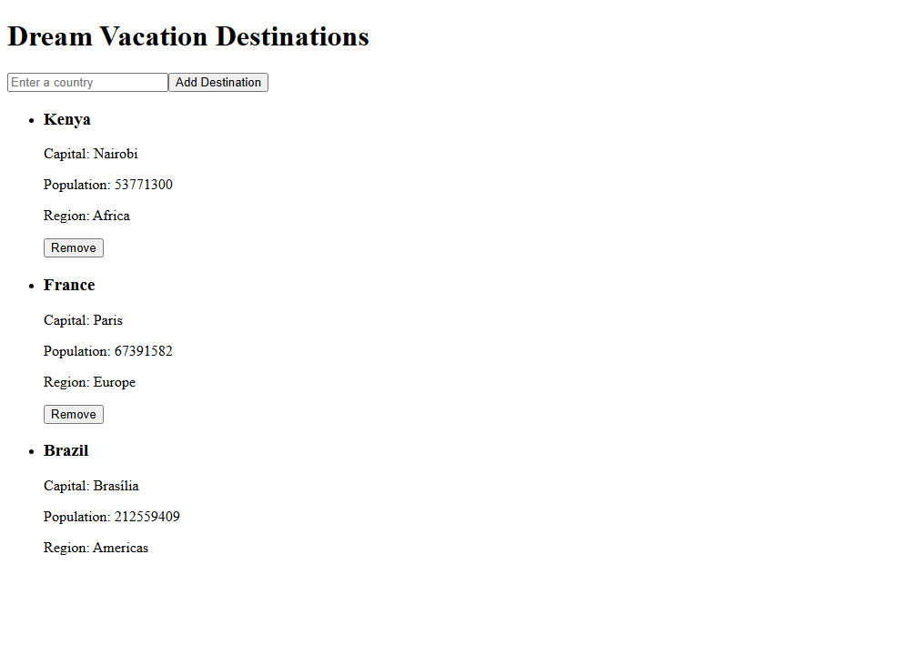
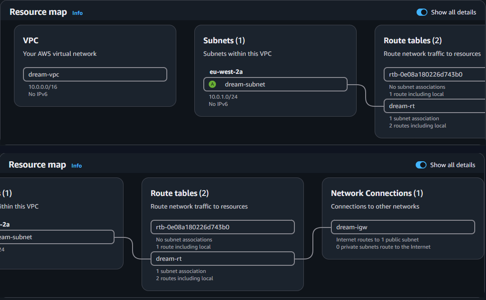
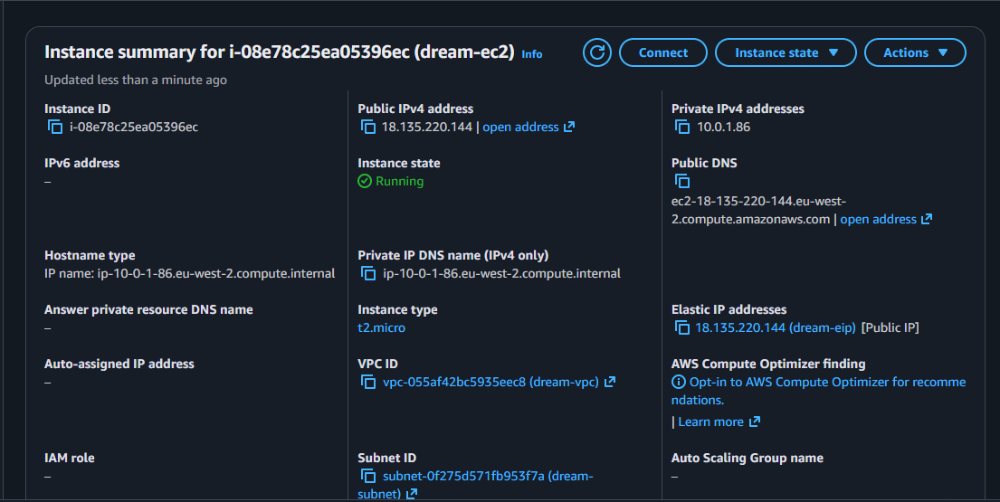
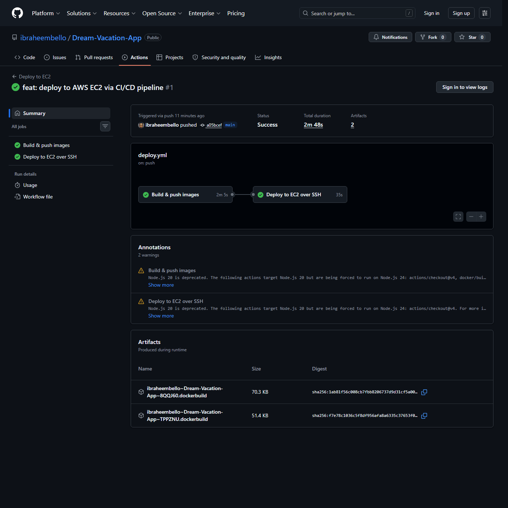

# 🌍 Dream Vacation App (Dockerized)

[](https://github.com/ibraheembello/Dream-Vacation-App/actions/workflows/backend.yml)
[](https://github.com/ibraheembello/Dream-Vacation-App/actions/workflows/frontend.yml)

A full-stack app for saving dream vacation destinations. A **React** frontend talks
to a **Node.js/Express** API, which stores data in **PostgreSQL** and enriches it
with country data from the public [REST Countries](https://restcountries.com) API.

The whole stack is containerized with **Docker** and orchestrated with **Docker
Compose**. Frontend, backend, and database each run as their own container and start
with a single command. It is built by a **GitHub Actions** CI/CD pipeline and
deployed to **AWS EC2**.

---

## 📸 Screenshot

The app running via `docker compose up --build`. React frontend (served by nginx)
reading from the Express backend and PostgreSQL:



---

## 🧱 Architecture

```
                        Host machine (your browser)
                                   │
              ┌────────────────────┼─────────────────────┐
              │ :3000                                     │ :3001
              ▼                                           ▼
   ┌────────────────────┐                      ┌────────────────────┐
   │   frontend          │                      │   backend          │
   │   React + nginx     │   REST Countries     │   Node + Express   │
   │   (static build)    │   (external API) ◄───┤                    │
   └────────────────────┘                      └─────────┬──────────┘
                                                          │ db:5432
                                                          ▼
                                               ┌────────────────────┐
                                               │   db                │
                                               │   PostgreSQL 16     │
                                               │   volume: db-data   │
                                               └────────────────────┘

   All three services share the custom bridge network "dvapp-net" and
   resolve each other by service name (backend to db).
```

| Service    | Image / Build             | Container port | Host port         |
|------------|---------------------------|----------------|-------------------|
| `frontend` | multi-stage build, nginx  | 80             | `3000`            |
| `backend`  | `node:18-alpine`          | 3001           | `3001`            |
| `db`       | `postgres:16-alpine`      | 5432           | *(internal only)* |

---

## 📂 Project structure

```
Dream-Vacation-App/
├── backend/
│   ├── Dockerfile              # Node API image (non-root, prod deps only)
│   ├── server.js
│   └── package.json
├── frontend/
│   ├── Dockerfile              # Multi-stage: node build, then nginx serve
│   ├── nginx.conf              # SPA routing + gzip + /api proxy to backend
│   └── src/ ...
├── db/
│   └── init.sql                # Creates the `destinations` table on first boot
├── deploy/
│   └── remote-deploy.sh        # Runs on the EC2 box during a deploy
├── docker-compose.yml          # Local orchestration (builds images)
├── docker-compose.prod.yml     # EC2 orchestration (pulls GHCR images)
├── .github/workflows/          # backend.yml, frontend.yml, deploy.yml
├── .env.example
└── README.md
```

---

## ✅ Prerequisites

- [Docker Engine](https://docs.docker.com/engine/install/) 20.10+
- [Docker Compose](https://docs.docker.com/compose/) v2 (bundled with Docker Desktop)

```bash
docker --version
docker compose version
```

---

## 🚀 Setup and run (local)

### 1. Clone the repository

```bash
git clone https://github.com/ibraheembello/Dream-Vacation-App.git
cd Dream-Vacation-App
```

### 2. Create your environment file

The app reads configuration and secrets from a `.env` file that is never committed.
Copy the template and edit the values:

```bash
cp .env.example .env
```

`.env` contents (the defaults work out of the box for local use):

```ini
POSTGRES_USER=dreamuser
POSTGRES_PASSWORD=change_me_to_a_strong_password
POSTGRES_DB=dreamvacations

BACKEND_PORT=3001
COUNTRIES_API_BASE_URL=https://restcountries.com/v3.1

REACT_APP_API_URL=
FRONTEND_PORT=3000
```

### 3. Build and start everything

```bash
docker compose up --build
```

This builds all images and starts the three containers. The backend waits for
PostgreSQL to be healthy before it starts, so there is no cold-start race. The
`destinations` table is created automatically on first launch.

Run it in the background instead:

```bash
docker compose up --build -d
```

### 4. Open the app

| What        | URL                                    |
|-------------|----------------------------------------|
| Frontend    | http://localhost:3000                  |
| Backend API | http://localhost:3000/api/destinations |

Type a country (for example `Japan`), click **Add Destination**, and it appears in
the list. The data is persisted in PostgreSQL.

---

## 🔍 Verify it's working

```bash
# 1. All three containers are "Up" (db should be "healthy")
docker compose ps

# 2. Frontend is served by nginx (expect HTTP/1.1 200 OK)
curl -I http://localhost:3000

# 3. API responds through the nginx proxy (expect [] then JSON rows)
curl http://localhost:3000/api/destinations

# 4. Create a destination
curl -X POST http://localhost:3000/api/destinations \
  -H "Content-Type: application/json" \
  -d '{"country":"Japan"}'

# 5. Confirm the table exists inside the db container
docker compose exec db psql -U dreamuser -d dreamvacations -c "\dt"

# 6. Confirm service-name networking (backend can resolve "db")
docker compose exec backend getent hosts db
```

---

## 🔒 Persistence test

Data survives container restarts because PostgreSQL writes to the named `db-data`
volume:

```bash
docker compose down      # stop and remove containers, volume is kept
docker compose up -d     # bring it back
curl http://localhost:3000/api/destinations   # data is still there
```

Wipe the database too by removing the volume:

```bash
docker compose down -v
```

---

## 🔁 CI/CD pipeline (GitHub Actions)

Every push and pull request builds, tests, and (on push) publishes Docker images.
The frontend and backend have separate workflows so they build and fail
independently.

| Workflow file                    | Watches       | Node | Image on GHCR                                      |
|----------------------------------|---------------|------|----------------------------------------------------|
| `.github/workflows/backend.yml`  | `backend/**`  | 18   | `ghcr.io/ibraheembello/dream-vacation-app-backend`  |
| `.github/workflows/frontend.yml` | `frontend/**` | 16   | `ghcr.io/ibraheembello/dream-vacation-app-frontend` |

### How it runs

```
push / pull_request  ->  branches: main, dev
        │
        ├─ paths filter: only run the workflow whose folder changed
        │
        ▼
   ┌─────────────┐        ┌──────────────────────────┐
   │  CI job     │  needs │  CD job                   │
   │  (always)   ├───────►│  (push events only)       │
   │             │        │                           │
   │ npm ci      │        │ log in to GHCR            │
   │ lint        │        │ tag with commit SHA       │
   │ npm test    │        │ build and push image      │
   │ docker build│        │                           │
   └─────────────┘        └──────────────────────────┘
```

Each workflow has two jobs, which keeps CI separate from CD:

1. **`ci`** runs on both pushes and pull requests. It installs deps with `npm ci`,
   runs lint (`npm run lint --if-present`), runs the tests (`npm test`), and checks
   that the Docker image builds. A broken PR is caught here before anything ships.
2. **`cd`** has `needs: ci` (only runs if CI passed) and `if: github.event_name ==
   'push'` (pull requests never publish). It logs in, tags, and pushes the image.

### Registry and authentication

Images go to the **GitHub Container Registry (GHCR)**. Login uses the built-in
`GITHUB_TOKEN`, so there are no credentials to set up by hand:

```yaml
- uses: docker/login-action@v3
  with:
    registry: ghcr.io
    username: ${{ github.actor }}
    password: ${{ secrets.GITHUB_TOKEN }}
```

The `cd` job requests `packages: write` so that token can push. To use Docker Hub
instead, swap the login step for `${{ secrets.DOCKER_USERNAME }}` and
`${{ secrets.DOCKER_TOKEN }}` and add those two values under
**Settings, Secrets and variables, Actions**.

### Image tagging

Tags come from `docker/metadata-action`:

- `type=sha` tags every image with its commit SHA (for example `sha-1a2b3c4`)
- `type=ref,event=branch` adds a per-branch tag (`main`, `dev`)
- `type=raw,value=latest` adds `latest`, only on `main`

---

## ☁️ AWS deployment (Stage 6)

The app is deployed to an **AWS EC2** instance. The pipeline's final stage ships
every push to `main` automatically over SSH.

### Infrastructure (custom VPC)

| Resource         | Name           | Detail                                     |
|------------------|----------------|--------------------------------------------|
| VPC              | `dream-vpc`    | `10.0.0.0/16`                              |
| Subnet           | `dream-subnet` | `10.0.1.0/24` (public, auto-assign IP)     |
| Internet Gateway | `dream-igw`    | attached to `dream-vpc`                    |
| Route Table      | `dream-rt`     | `0.0.0.0/0` to `dream-igw`                 |
| Security Group   | `dream-sg`     | inbound `22` (SSH), `80` (HTTP)            |
| EC2              | `dream-ec2`    | Ubuntu 22.04, `t2.micro`, Docker via user-data |
| Elastic IP       | `dream-eip`    | stable public address for deploys          |

```
Internet ──► Elastic IP ──► EC2 (t2.micro, dream-subnet)
                                └── docker-compose.prod.yml
                                     ├── frontend (nginx :80) ── proxies /api ──►┐
                                     ├── backend  (:3001, internal)  ◄───────────┘
                                     └── db (postgres, named volume)
```

The browser hits `http://<EC2_PUBLIC_IP>/`. Nginx serves the React bundle and
proxies `/api/*` to the backend over the internal Docker network, so the backend
port is never exposed publicly.

### The deploy pipeline (`.github/workflows/deploy.yml`)

On every push to `main`:

1. **`build-and-push`** builds the backend and frontend images and pushes them to
   GHCR tagged `:latest` and `:sha-<commit>`.
2. **`deploy`** (`needs: build-and-push`) SSHes into the EC2 box with the
   `EC2_SSH_KEY` secret, copies `docker-compose.prod.yml`, `deploy/remote-deploy.sh`,
   and `db/`, then runs the rollout: log in to GHCR, `docker compose pull`,
   `docker compose up -d`. A final step smoke-tests `http://<host>/` for HTTP 200.

`docker-compose.prod.yml` pulls the prebuilt images instead of building them. That
matters on a 1 GB `t2.micro`, which cannot compile the React bundle.

### Required GitHub secrets

| Secret              | Purpose                                          |
|---------------------|--------------------------------------------------|
| `EC2_HOST`          | EC2 Elastic IP (SSH and smoke-test target)       |
| `EC2_SSH_KEY`       | private key for the `dream-ec2-key` pair         |
| `POSTGRES_PASSWORD` | DB password written into the on-box `.env`       |
| `GITHUB_TOKEN`      | built-in, used to pull GHCR images on the box    |

### Deliverables

**VPC and subnet** (`dream-vpc`, `dream-subnet`, `dream-rt`, `dream-igw`)


**EC2 instance running** (`t2.micro`, state Running, Elastic IP attached)


**App live in the browser** (`http://<EC2_PUBLIC_IP>/`)


**CI/CD deployment logs** (successful SSH rollout)


Real output from the `Deploy to EC2 over SSH` job:

```text
Login Succeeded
>> Pulling images (IMAGE_TAG=sha-a05bcef...) ...
>> Starting stack ...
 Container dvapp-db        Healthy
 Container dvapp-backend   Started
 Container dvapp-frontend  Started
>> Deployed. Current state:
NAME             IMAGE                                            STATUS
dvapp-backend    .../dream-vacation-app-backend:sha-a05bcef...    Up (3001/tcp, internal)
dvapp-db         postgres:16-alpine                               Up (healthy)
dvapp-frontend   .../dream-vacation-app-frontend:sha-a05bcef...   Up (0.0.0.0:80->80/tcp)
Waiting for the app to answer on http://<host>/ ...
  attempt 1 -> HTTP 200
App is live
```

---

## 🛠️ Troubleshooting

- **Port already in use:** change `FRONTEND_PORT` or `BACKEND_PORT` in `.env`.
- **DB changes not taking effect:** `db/init.sql` only runs when the volume is empty.
  Run `docker compose down -v` to re-initialize from scratch.
- **Added countries show `N/A` or `0`:** the public REST Countries `v3.1` API used
  by the original app was deprecated upstream and now returns a notice instead of
  data. The backend handles this: the destination is still saved and the app keeps
  working, just with placeholder details. Point `COUNTRIES_API_BASE_URL` at a working
  country API to restore rich data.

---

## 🧰 Technologies

- **Frontend:** React (Create React App), served by nginx
- **Backend:** Node.js + Express
- **Database:** PostgreSQL 16
- **External API:** REST Countries
- **Containerization:** Docker, Docker Compose
- **CI/CD:** GitHub Actions and GitHub Container Registry (GHCR)
- **Cloud:** AWS (custom VPC, EC2 `t2.micro`, Elastic IP)
